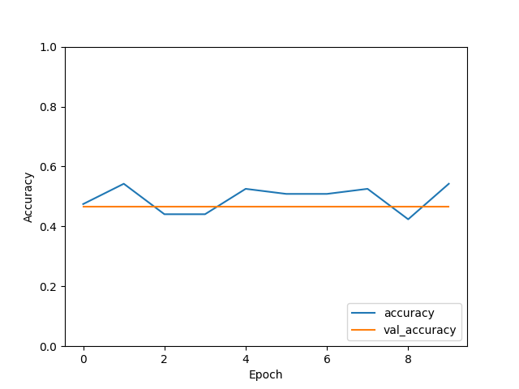

# Sentiment Analysis

#### Taking IMDB Data to Analyze where the Stament from the individuals are the positive or not 

## Accuracy Graph

#### Tried to Improve Accuracy by increasing the DataSet & Dense Layer

## how it's Tranied 

#### It has benn trained via Using the TensorFlow Metal Libary leveraging the power of the Mac M1 GPU   

## Blog

